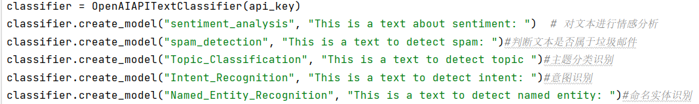
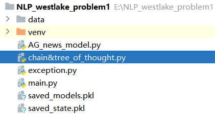

# 能处理一切异常的，多线程，可复用，可断点重爬的openai api调取代码，目的是解决情感分析等文本分类问题。
## 数据集[
AG news数据集
## 复现方式
源码位于百度网盘链接: https://pan.baidu.com/s/1asNxdICAlezMXGP518Zn6Q?pwd=8rb6 提取码: 8rb6  
注意必须将代码中出现的your_api_key替换为各自的api_key
## 实现功能

## 项目结构
 
main.py:主函数，调用已训练好的模型，实现各个功能，完成各个分类任务，采用了多进程。 
AG_news_model.py:选择AG news数据集训练出一个情感数据分析模型，并打印出轮数和相应轮数等训练信息。 
exception.py:处理各类异常。 
chain&tree_of_thought.py:设计样例对比chain-of-thought和tree-of-thought的运行结果和时间，限制生成文本的最大长度对运行时间也有较大影响，所以采用两种方法时必须规定相同的max_tokens。 
## 对NLP及chatgpt的展望
这次题目对我来说是一个巨大的挑战，在此前我并没有接触过任何的自然语言处理任务，因此只能利用课余时间尽己所能完成。
chatgpt想要深入挖掘，个人认为可以从两个方向出发：
###### 提高chatgpt完成任务或提供的解决方案的质量，通过大模型训练或异常数据加入训练
###### 拓展一些有深远意义但目前关注点不高的下游，比如对金融概念的理解，医疗领域，古诗词等中华优秀传统文化的传播
在这之后，打通NLP与CV或许会成为计算机领域的一个破局之路。
